<h1 align="center">
<!--      -->
  
</h1>

<picture>
  
</picture>

### 🤵 About Me
- 🛠 Skills: Vue, React, TS, Mini Program, Node.js, Ionic
- 📜 2023 Goals: Learn more about React and React Native
- 🎮 Hobby: Motorcycle, Travel, Movie and Games
- 📬 [Email me](mailto:j532547613@gmail.com)

---

### ✏️ Recent Blog
- [前端错误监控平台搭建](https://www.jiangyh.cn/2024/02/26/js/monitor/index.html) / 2024-02-26
- [puppeteer生成pdf卡顿解决方案](https://www.jiangyh.cn/2023/12/28/node/puppeteer-pdf/index.html) / 2023-12-28
- [Serve-Send Events(SSE) + Visibility API项目中应用](https://www.jiangyh.cn/2023/12/10/js/sse/index.html) / 2023-12-10
- [解决puppeteer依赖chromium内核下载失败问题](https://www.jiangyh.cn/2023/09/19/node/puppeteer/index.html) / 2023-09-19
- [从零搭建前端脚手架CLI工具](https://www.jiangyh.cn/2023/09/05/node/myself-cli/index.html) / 2023-09-05
- [通过node调用Jenkins API完成构建过程](https://www.jiangyh.cn/2023/08/28/node/node-jenkins/index.html) / 2023-08-28
- [more blog](https://www.jiangyh.cn/)

---

### 🏔 Github
<!-- 
 -->

